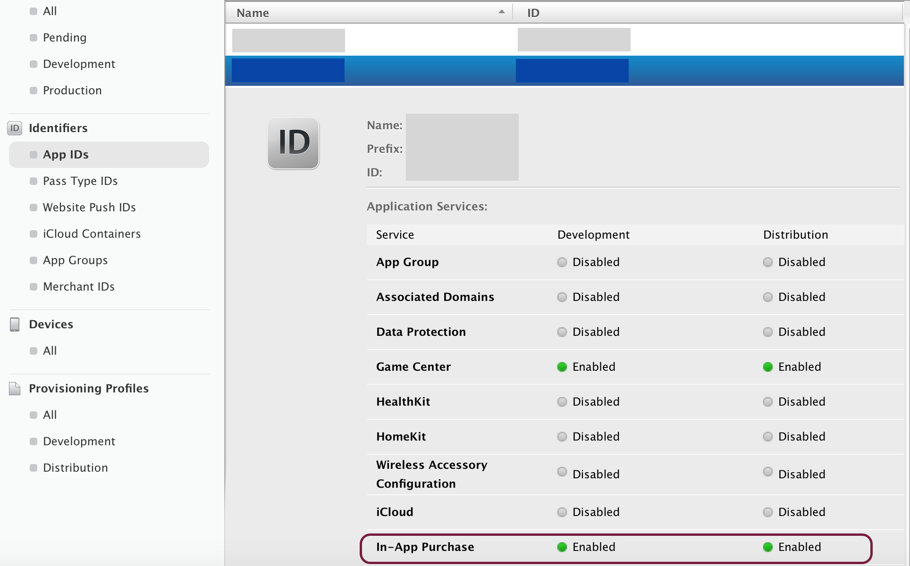
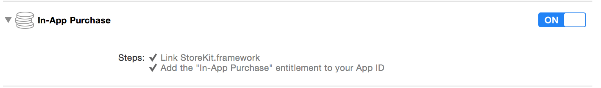
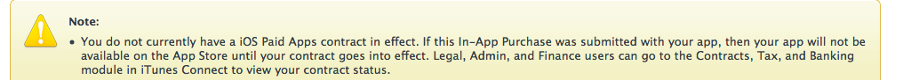
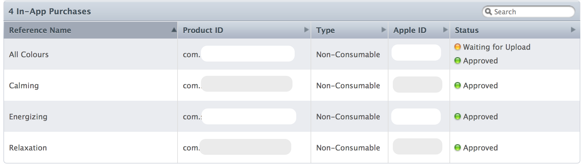
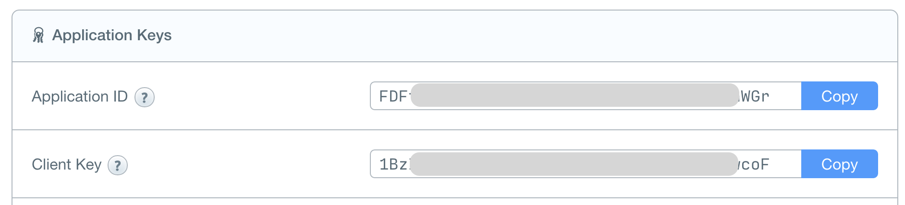
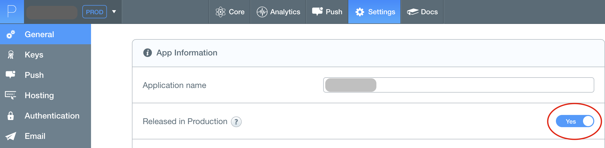
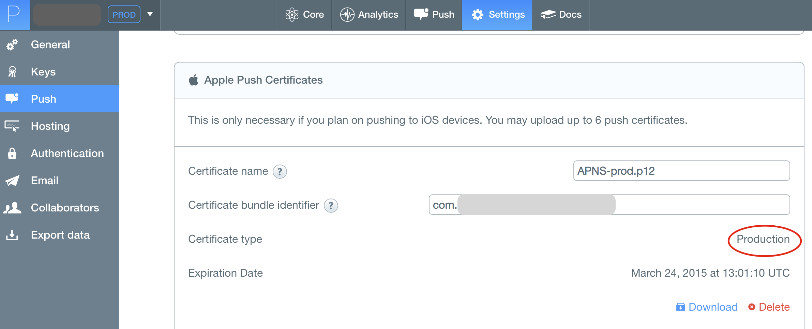

# submit-to-appstore-objc

Checklist for iOS developer before submitting app to AppStore. 


## iTunesConnect & developer.apple.com
  * Install publisher's provision profile (containing private key p12).
  * Install distribution certificate containing your app's BundleID.
  * Prepare app in iTunesConnect for your app's BundleID. 
     * Provide description and l10ns for all relevant languages.
     * Provide screenshots/videos in iTunesConnect.
          
  
  
## APNS
  * Make sure that APNS certificate includes your app's BundleID.
  * You have created distribution APNS certificate.
  * Your server is using distribution APNS certificate.
  * Check that notifications are working on different iOS versions (pay attention on **iOS8** where API was changed).
  

## Versioning
  * Do not hardcode anywhere in sources things like `isBeta=YES` or `DEBUG=YES`.
  * Make sure that app icon or name doesn't contain `beta` word.
  
  * Update app version and build version. Never harcode version inside app (use CFBundleVersion instead).
  
  
## Version compatibility  
  * Make sure that new release is installed over old version in correct way: 
    * Install app from AppStore. Create ad-hoc build and install it over old version.
    * Check that user doesn't lose any his info after update. 
    
      
  * Check that data from **NSUserDefaults** is read in correct way: 
    * app doesn't crash trying to read unexisting keys
    * your haven't changed keys in `initWithCoder` and `encodeWithCoder` (your current app should be able to read data saved by old app)
    
    
## iOS SDK API updates:
  * check that geolocation is working ([iOS8 SDK](http://stackoverflow.com/a/24063578))
  * check that local notifications are wokring (iOS8 SDK)
  * push notifications should work too =)	
  
  
## Server
  * Connect application to production server environment. 
  * Do not send `beta=1` (or similar) in any server requests.
  * If app is configurated from server (for example, it downloads DB), make sure that configuration is updated in correct way. If configuration needs to be updated every N hours - it really does.
    
    
## Tools
  * Enable crash analytics tool like [Crashlytics](https://crashlytics.com).
  * Enable flow analytics tool like [Flurry](http://www.flurry.com/).
  * Disable `NSLog` calls. At least like this
  
  ``` objective-c
  #define NSLog(...) /* */
  ```
    
    
## In-App Purchases
  * Enable IAPs for your app id in developer.app.com
  
  
  * Enable IAPs in Xcode Build Settings
  
  
  * Submit finance docs (without doing it, app doesn't receive even list of in-apps) in iTunesConnect:
  
  
  * Make sure, that if you've hardcoded IAPs IDs, they are the same in iTunes  Connect app too. 
  
  
  * In-apps are displaying correctly. Test user can make purchases.
  * In-apps are submitted for review! Otherwise in-apps won't be available even if app version was reviewed.
  
  
## Specific services
### Parse.com
  * Check AppDelegate and make sure that `applicationId` and `clientKey` are used from production account.
  
  **AppDelegate**
  
  ``` objective-c
  // --------------------- Parse credentials:
    [Parse setApplicationId:@"FDF...WGr" clientKey:@"1BzI...F"];
  ```
  
  Parse.com application keys
  
  Keys should be the same in Settings and AppDelegate.
  
  
  * Deploy Cloud code to production account!
  * Parse application is marked as 'PROD' in Settings
  
  
  * If you're using APNS, set production certificate in Settings 
  
  
  
### Facebook
  * Make sure, that you are using production app, check client key and perform successful login/sharing to Fb.
  * Disable **Sandbox** mode for Fb app.
  * If you are using GraphStory, submit them to review, describe steps-to-reproduce and add necessary screenshots.
  
  
## App extensions (widgets)
  * Create separate bundle ID. Usuall it looks like `com.company.appName.widgetName`. 
  * Generate distribution mobile provisions for widget
  * Make sure that `app groups` are included in both provisions: host app and extension.
  * Check that widget is using production server URL / production Parse keys. 


## Apple docs
Also, you can find useful Apple guides:

* Common App Rejections
 
  https://developer.apple.com/app-store/review/rejections/

* App Review Guidelines

  https://developer.apple.com/app-store/review/guidelines/
